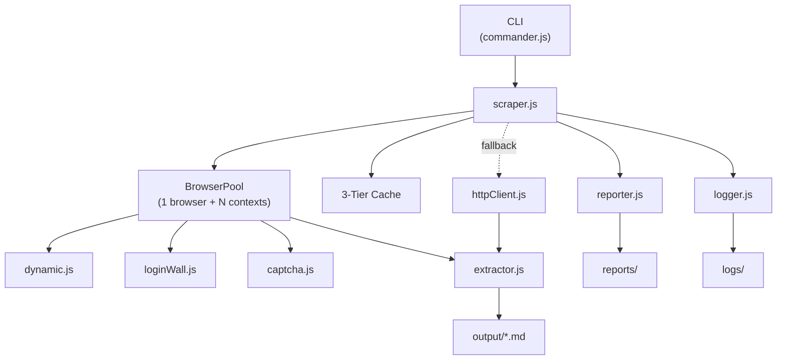

# Wikiscraper

**Convert any public web page into clean markdown for LLM workflows** — similar to [Firecrawl](https://firecrawl.dev), but self-hosted and CLI-first.

Headless rendering with **Playwright** + Chromium, smart main-content extraction, and **GitHub-flavored Markdown** output. Built for RAG pipelines, agent context, and batch data collection.

**Repository:** [github.com/Asifptm/Wikiscarper-2.0](https://github.com/Asifptm/Wikiscarper-2.0)

```
███████╗███████╗ ██████╗██████╗  █████╗ ██████╗ ███████╗██████╗
██╔════╝██╔════╝██╔════╝██╔══██╗██╔══██╗██╔══██╗██╔════╝██╔══██╗
█████╗  ███████╗██║     ██████╔╝███████║██████╔╝█████╗  ██████╔╝
██╔══╝  ╚════██║██║     ██╔══██╗██╔══██║██╔═══╝ ██╔══╝  ██╔══██╗
███████╗███████║╚██████╗██║  ██║██║  ██║██║     ███████╗██║  ██║
╚══════╝╚══════╝ ╚═════╝╚═╝  ╚═╝╚═╝  ╚═╝╚═╝     ╚══════╝╚═╝  ╚═╝
                                                        v2.0.0
```

---

## Table of Contents

- [Features](#features)
- [Resource Efficiency](#resource-efficiency)
- [How It Works](#how-it-works)
- [Architecture](#architecture)
- [Installation](#installation)
- [Usage](#usage)
- [Configuration](#configuration)
- [Project Structure](#project-structure)
- [Output](#output)
- [Tech Stack](#tech-stack)

---

## Features

- **No login required** — public HTTP fetch first, automatic login-wall dismissal, and site-specific public endpoints (Reddit, Instagram) for every URL.
- **LLM-ready markdown** — extracts main content only; strips nav, ads, scripts, and CSS noise.
- **Site-specific public scrapers** — Reddit, Instagram, X, YouTube, TikTok, LinkedIn, Pinterest, and Facebook profiles/posts via public endpoints (no login).
- **Single `scrape` command** — one or many URLs, optional `--file`, stdout/JSON output.
- **Real browser rendering** — Playwright + Chromium when public fetch is not enough.
- **3-tier cache** — Memory (LRU) → SQLite → Disk (gzip blobs).
- **JSON output** — structured response with markdown + metadata (`--format json`).
- **Low resource footprint** — single shared browser, idle auto-close, blocked heavy assets.
- **CAPTCHA handler** — browser-native solver enabled by default (`--no-captcha` to disable).
- **Full-page mode** — optional nav/footer/link sections with `--full`.
- **Content images** — every scrape extracts image URLs and links them in the markdown (`--no-images` to disable).
- **Auto site handlers** — Reddit, Instagram, X, YouTube, TikTok, LinkedIn, Pinterest, and Facebook URLs are detected automatically on any scrape.

---

## Resource Efficiency


| Optimization                | What it does                                                  |
| --------------------------- | ------------------------------------------------------------- |
| **Single shared browser**   | One Chromium process; each job gets a cheap `BrowserContext`. |
| **Idle auto-close**         | Browser closes after `idleTimeout` when no scrape is running. |
| **Blocked heavy resources** | Images, CSS, fonts, media aborted by default.                 |
| **Fast wait strategy**      | Default `domcontentloaded` for quicker loads.                 |
| **Slim memory cache**       | Memory tier stores Markdown only; HTML stays in SQLite/disk.  |
| **Bounded caches**          | Size caps on memory and disk cache tiers.                     |


---

## How It Works

1. You pass one or more public URLs to `scrape` (or `--file urls.txt`).
2. The engine checks **cache**; on a hit, markdown is returned instantly.
3. On a miss, it tries **public access** automatically:
  - Known sites (Reddit → old.reddit, Instagram → oEmbed) use dedicated public APIs
  - All other URLs try a **direct HTTP fetch** first (no login, no browser)
  - If content is blocked or too thin, **headless Chromium** loads the page and **dismisses login walls**
4. **Main content** is extracted and converted to clean markdown for LLM use.
5. Output is saved to `output/` or printed with `--stdout`.

---

## Architecture




| Layer                     | Responsibility                               |
| ------------------------- | -------------------------------------------- |
| **CLI** (`src/cli`)       | Commands, flags, terminal output.            |
| **Core** (`src/core`)     | Browser pool, scraping, extraction, reports. |
| **Cache** (`src/cache`)   | Memory → SQLite → Disk hierarchy.            |
| **Shared** (`src/shared`) | Config loading and utilities.                |


---

## Installation

### Prerequisites

- **Git**
- **Node.js 18+** (Node 22+ recommended)
- **npm**

### Clone and install

```bash
git clone https://github.com/Asifptm/Wikiscarper-2.0.git
cd Wikiscarper-2.0

npm install
npx playwright install chromium
```

> **SSH:** `git clone git@github.com:Asifptm/Wikiscarper-2.0.git`

Optional local overrides:

```bash
# Windows
copy config\local.json.example config\local.json

# macOS / Linux
cp config/local.json.example config/local.json
```

---

## Usage

### Quick start

```bash
# One URL → markdown on stdout
npm start scrape "https://example.com" --stdout

# Save to output/
npm start scrape "https://en.wikipedia.org/wiki/Web_scraping"

# Multiple URLs (no login — works for Reddit, Instagram, any public page)
npm start scrape "https://example.com" "https://www.reddit.com/r/MachineLearning/"

# URLs from file
npm start scrape --file urls.txt

# JSON response
npm start scrape "https://example.com" --format json --stdout
```

### Live progress UI

While scraping, the CLI shows:

- **Banner & config** — session header, options table, and target URLs
- **Single progress bar** — one updating line with percent, count, current URL, and phase
- **Results table** — colored `OK` / `FAIL` rows with HTTP status, captcha, words, time, URL, output file, and error

Use `--quiet` to suppress all terminal output.

```bash
npm start scrape "https://example.com"           # full progress UI
npm start scrape "https://example.com" --quiet   # silent mode
```

### No login required (automatic)

Every URL uses public access strategies automatically — no special flags:


| Site             | Strategy                                                              |
| ---------------- | --------------------------------------------------------------------- |
| **Any URL**      | Direct HTTP fetch first, then browser with login-wall dismissal       |
| **Reddit**       | Subreddit, user profile, and post pages via old.reddit.com           |
| **Instagram**    | Profile browser scrape + oEmbed for posts/reels (no login)            |
| **X / Twitter**  | Public syndication API for profiles and posts                         |
| **YouTube**      | Channel metadata + recent videos via ytInitialData                    |
| **TikTok**       | Profile + videos via embedded page data and oEmbed                    |
| **LinkedIn**     | Company/profile pages via JSON-LD + browser feed scrape               |
| **Pinterest**    | Profile pin grid via browser + pin metadata                           |
| **Facebook**     | Public pages via og metadata + browser feed scrape                    |
| **Social sites** | Login/sign-up modals removed (Instagram, Facebook, X, LinkedIn, etc.) |


```bash
# Reddit subreddit or user profile
npm start scrape "https://www.reddit.com/r/programming/"
npm start scrape "https://www.reddit.com/user/spez/"

# Instagram profile — bio, stats, recent posts (no login)
npm start scrape "https://www.instagram.com/microsoft/"

# X profile — bio + recent posts
npm start scrape "https://x.com/Reddit"

# YouTube channel
npm start scrape "https://www.youtube.com/@Microsoft/videos"

# TikTok profile
npm start scrape "https://www.tiktok.com/@microsoft"

# LinkedIn company page
npm start scrape "https://www.linkedin.com/company/microsoft/"

# Pinterest profile
npm start scrape "https://www.pinterest.com/pinterest/"

# Facebook public page
npm start scrape "https://www.facebook.com/Microsoft/"

# Any public page
npm start scrape "https://news.ycombinator.com"
```

### Commands

```bash
# Single or multiple URLs
npm start scrape "https://example.com"
npm start scrape "https://a.com" "https://b.com" -C 3

# From file + JSON output
npm start scrape --file urls.txt --format json

# Force browser only (skip public HTTP attempt)
npm start scrape "https://example.com" --browser-only

# HTTP only (no browser fallback)
npm start scrape "https://example.com" --direct-only

# Cache & reports
npm start cache stats
npm start cache clear --all
npm start report list

# Help
npm start scrape --help
```

### Key `scrape` flags


| Flag                    | Description                                   |
| ----------------------- | --------------------------------------------- |
| `--stdout`              | Print markdown or JSON to stdout (single URL) |
| `-f, --format <fmt>`    | `md` (default) or `json`                      |
| `--file <path>`         | Read URLs from file (one per line)            |
| `--full`                | Full page with nav/footer sections            |
| `--browser-only`        | Skip public HTTP fetch, use browser only      |
| `--direct-only`         | HTTP fetch only, no browser fallback          |
| `--no-public-first`     | Disable automatic public HTTP attempt         |
| `--no-llm-strict`       | Disable aggressive LLM cleanup (keep site chrome) |
| `--no-bypass-login`     | Do not dismiss login/sign-up modals           |
| `--no-cache`            | Bypass cache                                  |
| `--no-images`           | Skip extracting image URLs from content       |
| `-C, --concurrency <n>` | Parallel workers (multi-URL)                  |
| `-o, --output <dir>`    | Output directory                              |
| `-q, --quiet`           | Suppress progress UI                          |


---

## Configuration

Defaults: `config/default.json`. Overrides: `config/local.json`, `config/captcha.json`.

```json
{
  "scraper": {
    "concurrency": 3,
    "timeout": 30000,
    "waitFor": "domcontentloaded",
    "headless": true,
    "publicFirst": true,
    "bypassLogin": true,
    "blockResources": ["image", "media", "font", "stylesheet"]
  },
  "cache": {
    "memory": { "maxItems": 500, "maxSizeMB": 50, "ttl": 300 },
    "sqlite": { "ttl": 86400, "path": "./cache/scraper.db" },
    "disk": { "path": "./cache/blobs", "maxSizeMB": 2048 }
  },
  "output": {
    "dir": "./output",
    "mode": "llm",
    "frontMatter": false,
    "fullPage": false,
    "llmStrict": true
  },
  "reports": { "dir": "./reports" }
}
```

> If you see `browserType.launch: Executable doesn't exist...`, run `npx playwright install chromium`.

---

## Project Structure

```
wikiscraper/
├── config/
│   ├── default.json
│   ├── captcha.json
│   └── local.json.example
├── src/
│   ├── cache/          # Memory, SQLite, disk cache
│   ├── cli/            # CLI entry (commander)
│   ├── core/           # Scraper engine
│   └── shared/         # Config + utils
├── output/             # Generated Markdown
├── reports/            # Run reports
├── cache/              # Cache DB + blobs
└── logs/               # Rotating logs
```

---

## Output

**LLM strict mode (default)** — clean markdown optimized for LLM/RAG pipelines:

- Main content only (no nav, categories, edit links)
- Absolute URLs on all links
- Footnotes and Wikipedia boilerplate stripped
- Source URL included for grounding

```markdown
# Thermodynamics

> Source: https://en.wikipedia.org/wiki/Thermodynamics

**Thermodynamics** is a branch of physics that deals with heat, work, and temperature...

## Introduction

A description of any thermodynamic system employs the four laws...
```

Use `--no-llm-strict` to keep raw site chrome.

**JSON format** (`--format json`):

```json
{
  "success": true,
  "data": {
    "markdown": "# Example Domain\n\n...",
    "metadata": {
      "title": "Example Domain",
      "sourceURL": "https://example.com",
      "statusCode": 200,
      "wordCount": 28
    }
  }
}
```

Use `--full` for structured sections (Navigation, Content, Footer Links, All Links, Images). Use `--full` with front matter via `config/local.json` if needed.

---

## Tech Stack

- **Playwright** — headless Chromium automation
- **Turndown** (+ GFM) — HTML → Markdown
- **commander** — CLI framework
- **lru-cache** + **SQLite** + **zlib** — 3-tier cache
- **winston** — logging

---

## License

MIT
