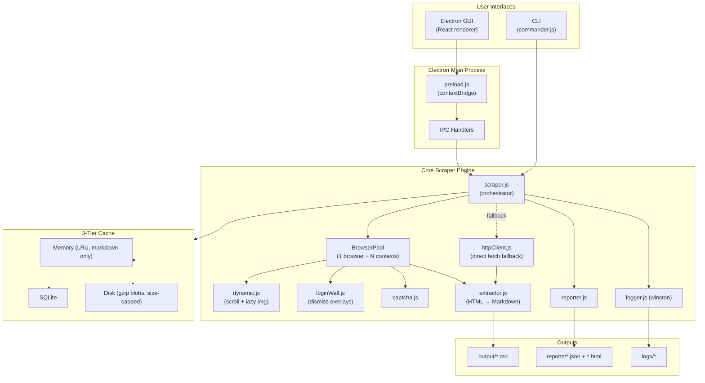
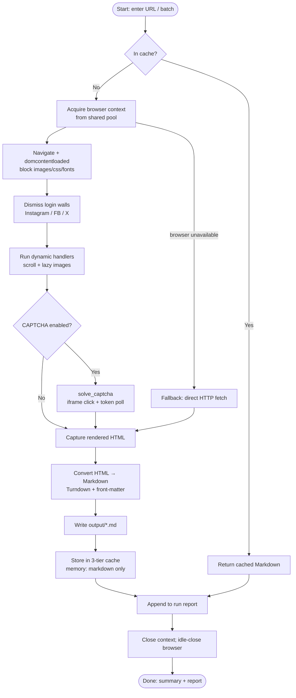

# ElectronScraper Pro

A production-grade web scraping framework that renders pages with a real Chromium browser (via **Playwright**), converts the result to clean **Markdown** (via **Turndown**), and caches everything through a fast **3-tier cache**. It ships with both a terminal-styled **Electron desktop GUI** and a full **command-line interface**.

Built for **low resource use and fast scrapes**: one shared browser, bounded caches, blocked heavy assets, and idle auto-close.

```
███████╗███████╗ ██████╗██████╗  █████╗ ██████╗ ███████╗██████╗
██╔════╝██╔════╝██╔════╝██╔══██╗██╔══██╗██╔══██╗██╔════╝██╔══██╗
█████╗  ███████╗██║     ██████╔╝███████║██████╔╝█████╗  ██████╔╝
██╔══╝  ╚════██║██║     ██╔══██╗██╔══██║██╔═══╝ ██╔══╝  ██╔══██╗
███████╗███████║╚██████╗██║  ██║██║  ██║██║     ███████╗██║  ██║
╚══════╝╚══════╝ ╚═════╝╚═╝  ╚═╝╚═╝  ╚═╝╚═╝     ╚══════╝╚═╝  ╚═╝
                                                        v2.0.0
```

---

## Table of Contents

- [Features](#features)
- [Resource Efficiency](#resource-efficiency)
- [How It Works](#how-it-works)
- [Architecture](#architecture)
- [Workflow Diagram](#workflow-diagram)
- [Installation](#installation)
- [Usage](#usage)
  - [Desktop GUI](#desktop-gui)
  - [Command Line](#command-line)
- [Configuration](#configuration)
- [Project Structure](#project-structure)
- [Output](#output)
- [Tech Stack](#tech-stack)

---

## Features

- **Real browser rendering** — Playwright + Chromium so JavaScript-heavy / dynamic pages render before extraction.
- **Clean Markdown output** — HTML converted to GitHub-flavored Markdown with YAML front-matter (title, URL, word count, timestamps, etc.).
- **3-tier cache** — Memory (LRU) → SQLite → Disk (gzip blobs) to avoid re-scraping and speed up repeated runs.
- **Low resource footprint** — single shared browser, idle auto-close, slim memory cache, blocked heavy assets (see [Resource Efficiency](#resource-efficiency)).
- **Dynamic content handling** — infinite-scroll and lazy-image handlers wait for content to load.
- **Login-wall dismissal** — removes Instagram/Facebook/X login pop-ups so **publicly visible** content can be extracted (no authentication).
- **Concurrency** — parallel scrapes via isolated browser contexts (not separate browser processes).
- **Browser-native CAPTCHA handling** — Selenium-style `solve_captcha`: iframe switch, widget click, token polling (no third-party API).
- **Reports** — JSON + HTML run reports summarizing every scrape.
- **Graceful fallback** — if the browser binary is unavailable, the engine falls back to a built-in HTTP fetch instead of crashing.
- **Two interfaces** — a black-themed terminal-style **Electron GUI** and a scriptable **CLI**.

---

## Resource Efficiency

The engine is tuned to stay **fast while using less memory, CPU, and disk**:

| Optimization | What it does |
|--------------|--------------|
| **Single shared browser** | One Chromium process serves all scrapes; each job gets a cheap isolated `BrowserContext` instead of launching N full browsers (~3× less RAM). |
| **Idle auto-close** | Browser shuts down after `idleTimeout` (default 60s) when no scrape is running, freeing memory while the GUI stays open. |
| **Low-memory launch flags** | GPU, extensions, background networking, and shared-memory usage disabled for a lighter browser footprint. |
| **Blocked heavy resources** | Images, CSS, fonts, and media are aborted by default — faster loads and less bandwidth for text→Markdown extraction. |
| **Fast wait strategy** | Default `domcontentloaded` instead of `networkidle` for quicker first paint. |
| **Slim memory cache** | Memory tier stores Markdown + metadata only; raw HTML stays in SQLite/disk. |
| **Bounded caches** | Memory LRU capped by size (`maxSizeMB`); disk cache evicts oldest blobs when over `maxSizeMB`. |

---

## How It Works

1. You provide one or more URLs (through the GUI or CLI).
2. The engine checks the **cache**. On a hit, stored Markdown is returned instantly.
3. On a miss, a **single shared Chromium browser** opens an isolated context and navigates to the URL (default wait: `domcontentloaded`).
4. Heavy assets (images, CSS, fonts, media) are **blocked** unless configured otherwise.
5. **Login-wall dismissal** runs for social sites (Instagram, Facebook, X) to remove sign-in overlays blocking public content.
6. **Dynamic handlers** run (auto-scroll, lazy-image loading), and optional **CAPTCHA** handling uses browser-native `solve_captcha` (iframe click + token wait).
7. Rendered HTML is captured and converted to **Markdown** by Turndown.
8. Markdown is written to `output/`, stored in cache tiers, and recorded in a **run report**.
9. The browser context closes; after idle timeout, the shared browser may shut down to free memory.

---

## Architecture



The codebase is split into clear layers:

| Layer | Responsibility |
|-------|----------------|
| **Interfaces** (`src/renderer`, `src/cli`) | Collect input and present results — GUI or terminal. |
| **Electron main** (`src/main`) | Window lifecycle, secure IPC bridge between renderer and engine. |
| **Core engine** (`src/core`) | Single-browser pool, navigation, login-wall dismissal, dynamic handling, extraction, reporting, logging. |
| **Cache** (`src/cache`) | Memory → SQLite → Disk lookup hierarchy with size limits. |
| **Shared** (`src/shared`) | Config loading and common utilities. |

---

## Workflow Diagram



---

## Installation

### Prerequisites

- **Node.js 18+** (Node 22+ recommended)
- **npm**
- Windows / macOS / Linux

### Steps

```bash
# 1. Install dependencies
npm install

# 2. Install the Chromium browser used by Playwright
#    (the postinstall hook attempts this automatically; run manually if needed)
npx playwright install chromium

# 3. Build the GUI renderer
npm run build:renderer
```

> If you see `browserType.launch: Executable doesn't exist...`, run:
> ```bash
> npx playwright install chromium
> ```
> On Windows, browsers install to `%LOCALAPPDATA%\ms-playwright`.

---

## Usage

### Desktop GUI

```bash
npm start
```

A black, terminal-styled window opens with a brief splash, then the main menu.

**To scrape:**

1. Choose **SCRAPE** from the main menu.
2. **Option 1 — SET TARGET URL + SCRAPE** — type a link and press Enter; scraping starts immediately.
3. **Option 2 — SET BATCH URLS + SCRAPE** — enter one URL per line, then type `9` to start the batch.

No hardcoded URLs — you always enter real links. Scroll, CAPTCHA, cache, login-wall dismissal, and reporting are **enabled by default** (not shown as menu toggles). Progress and results stream into the output log; Markdown files are saved to `output/`.

**Other menu panels:** Cache stats/clear and report viewing are available from the main menu.

### Command Line

```bash
# Scrape a single URL
npm run cli -- crawl "https://en.wikipedia.org/wiki/Web_scraping"

# Scrape multiple URLs with options
npm run cli -- crawl "https://a.com" "https://b.com" --scroll --report

# Use the lightweight built-in HTTP fetch (no browser)
npm run cli -- crawl "https://example.com" --direct

# Keep login/sign-up walls (do not dismiss them)
npm run cli -- crawl "https://example.com" --no-bypass-login

# Batch from a file (one URL per line, # for comments)
npm run cli -- batch --file urls.txt --concurrency 5 --report

# Cache management
npm run cli -- cache stats
npm run cli -- cache list
npm run cli -- cache clear --all

# Reports
npm run cli -- report list
npm run cli -- report show <id>

# Re-export cached Markdown
npm run cli -- export --url "https://example.com"
```

**Key `crawl` flags:** `--scroll`, `--captcha`, `--concurrency <n>`, `--no-cache`, `--direct`, `--no-bypass-login`, `--proxy <url>`, `--report`, `--timeout <ms>`, `--output <dir>`, `--wait <strategy>`.

---

## Configuration

Defaults live in `config/default.json`. Create `config/local.json` to override any value. CAPTCHA settings go in `config/captcha.json`.

```json
{
  "scraper": {
    "concurrency": 3,
    "timeout": 30000,
    "waitFor": "domcontentloaded",
    "idleTimeout": 60000,
    "blockResources": ["image", "media", "font", "stylesheet"],
    "headless": true
  },
  "cache": {
    "memory": { "maxItems": 500, "maxSizeMB": 50, "ttl": 300 },
    "sqlite": { "ttl": 86400, "path": "./cache/scraper.db" },
    "disk": { "path": "./cache/blobs", "ttl": 604800, "maxSizeMB": 2048 }
  },
  "output": { "dir": "./output", "frontMatter": true },
  "captcha": { "mode": "auto", "timeout": 120000, "pollInterval": 500 },
  "reports": { "dir": "./reports" },
  "logging": { "level": "info", "dir": "./logs" }
}
```

| Option | Description |
|--------|-------------|
| `scraper.waitFor` | Page wait strategy: `domcontentloaded` (fast) or `networkidle` (heavier). |
| `scraper.idleTimeout` | Ms before the shared browser closes when idle (default 60000). |
| `scraper.blockResources` | Resource types to abort (`image`, `stylesheet`, `font`, `media`, etc.). Set to `[]` to load everything. |
| `cache.memory.maxSizeMB` | Max RAM for the in-memory LRU (Markdown only, no raw HTML). |
| `cache.disk.maxSizeMB` | Max disk usage; oldest blobs evicted when exceeded. |

**CAPTCHA:** Browser-native `solve_captcha` in `src/core/captcha.js` — detects reCAPTCHA, hCaptcha, and Turnstile, switches into the iframe (Selenium-style), clicks the widget, and polls for a response token. Set `"mode": "manual"` in `config/captcha.json` to wait for you to solve it in the browser. Works best with `"headless": false` in scraper config when challenges appear.

**Login walls:** Enabled by default for public content on Instagram, Facebook, and X. This does **not** log in or access private/login-required data.

---

## Project Structure

```
wikiscraper/
├── config/
│   ├── default.json        # Base configuration
│   └── captcha.json        # CAPTCHA mode / timeout
├── src/
│   ├── cache/              # 3-tier cache
│   │   ├── memory.js       #   Size-capped LRU (markdown only)
│   │   ├── sqlite.js       #   SQLite persistence
│   │   ├── disk.js         #   Gzip blob store + size eviction
│   │   └── index.js        #   Cache manager / orchestrator
│   ├── core/               # Scraping engine
│   │   ├── scraper.js      #   Orchestrator + single-browser pool
│   │   ├── dynamic.js      #   Infinite scroll + lazy images
│   │   ├── loginWall.js    #   Dismiss login/sign-up overlays
│   │   ├── extractor.js    #   HTML → Markdown (Turndown)
│   │   ├── httpClient.js   #   Built-in HTTP fetch fallback
│   │   ├── captcha.js      #   Browser-native solve_captcha
│   │   ├── reporter.js     #   JSON/HTML run reports
│   │   └── logger.js       #   Winston logging
│   ├── cli/
│   │   └── index.js        # Commander CLI
│   ├── main/               # Electron main process
│   │   ├── index.js        #   Window + app lifecycle
│   │   ├── ipc-handlers.js #   IPC endpoints
│   │   ├── preload.js      #   Secure contextBridge API
│   │   └── tray.js         #   System tray
│   ├── renderer/           # React GUI (terminal theme)
│   │   ├── App.jsx
│   │   ├── components/     #   ScrapePanel, CachePanel, ReportsPanel
│   │   └── terminal/       #   Boot screen, menus, terminal widgets
│   └── shared/
│       ├── config.js       # Config loader/merger
│       └── utils.js        # Shared helpers
├── output/                 # Generated Markdown
├── reports/                # Generated reports
├── cache/                  # Cache DB + blobs
├── logs/                   # Rotating logs
├── vite.config.js          # Renderer build config
└── package.json
```

---

## Output

Each scraped page is written to `output/<slug>.md` with YAML front-matter:

```markdown
---
title: "Web scraping - Wikipedia"
url: "https://en.wikipedia.org/wiki/Web_scraping"
scraped_at: "2026-06-16T15:44:32.528Z"
status: 200
word_count: 6142
image_count: 12
link_count: 467
---
# Web scraping - Wikipedia
...
```

Run reports are saved to `reports/` in both JSON and HTML.

---

## Tech Stack

- **Electron** — desktop shell (Chromium + Node.js)
- **React + Vite** — GUI renderer
- **Playwright** — headless browser automation (primary engine)
- **Turndown** (+ GFM plugin) — HTML → Markdown
- **commander** — CLI framework
- **lru-cache** + **SQLite** + **zlib** — 3-tier cache
- **winston** — structured, rotating logs

---

## License

MIT
